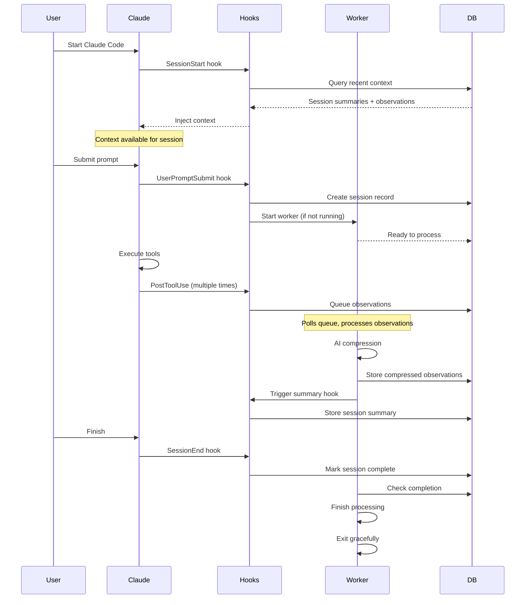

# Legacy Hooks Architecture

<Note>
This page is historical reference material. For the current implementation, use [Hook Architecture](architecture/hooks) and [Worker Service](architecture/worker-service).
</Note>

## What This Page Covers

This document describes an earlier ccx-ecc-mem architecture centered on separate hook scripts such as `context-hook.js`, `new-hook.js`, `save-hook.js`, and `summary-hook.js`.

That design is no longer the primary runtime shape.

## Current Architecture

The current system routes lifecycle events through a unified hook entry:

```text
plugin/hooks/hooks.json
  → bun-runner.js / worker-service.cjs
  → worker-service.cjs hook claude-code <event>
  → src/cli/hook-command.ts
  → src/cli/handlers/*
  → local worker HTTP API
```

Current lifecycle coverage includes `Setup`, `SessionStart`, `UserPromptSubmit`, `PostToolUse`, `PreToolUse` (for `Read`), `Stop`, and `SessionEnd`.

## Historical Summary

The earlier design used dedicated hook scripts for different lifecycle stages. That model helped prove out context injection and asynchronous observation capture, but it has since been replaced by the unified CLI entry and worker-centered runtime documented elsewhere.

Historical concepts from that phase included:

- separate hook executables per lifecycle concern
- command chaining during startup
- direct references to `src/hooks/*.ts` as primary hook entrypoints
- a hook-centric explanation of the runtime instead of today’s worker-centered route/module view

## When To Use This Page

Use this page only when you need historical context for old commits, older releases, or legacy discussions.

For current behavior, implementation details, and debugging guidance, use:

- [Hook Architecture](architecture/hooks)
- [Worker Service](architecture/worker-service)
- [Development](development)
- [Configuration](configuration)

  },
  "created_at_epoch": 1698765432
}
```

**Source:** `src/hooks/save-hook.ts` → `plugin/scripts/save-hook.js`

---

### Hook 4: Stop Hook (Summary Generation)

**Purpose:** Generate AI-powered session summaries during the session

**When:** When Claude stops (triggered by Stop lifecycle event)

**What it does:**
1. Gathers session observations from database
2. Sends to Claude Agent SDK for summarization
3. Processes response and extracts structured summary
4. Stores in session_summaries table

**Configuration:**
```json
{
  "hooks": {
    "Stop": [{
      "hooks": [{
        "type": "command",
        "command": "${CLAUDE_PLUGIN_ROOT}/scripts/summary-hook.js"
      }]
    }]
  }
}
```

**Key decisions:**
- ✅ Triggered by Stop lifecycle event
- ✅ Multiple summaries per session (v4.2.0+)
- ✅ Summaries are checkpoints, not endings
- ✅ Uses Claude Agent SDK for AI compression

**Summary structure:**
```xml
<summary>
  <request>User's original request</request>
  <investigated>What was examined</investigated>
  <learned>Key discoveries</learned>
  <completed>Work finished</completed>
  <next_steps>Remaining tasks</next_steps>
  <files_read>
    <file>path/to/file1.ts</file>
    <file>path/to/file2.ts</file>
  </files_read>
  <files_modified>
    <file>path/to/file3.ts</file>
  </files_modified>
  <notes>Additional context</notes>
</summary>
```

**Source:** `src/hooks/summary-hook.ts` → `plugin/scripts/summary-hook.js`

---

### Hook 5: SessionEnd (Cleanup Hook)

**Purpose:** Mark sessions as completed when they end

**When:** Claude Code session ends (not on `/clear`)

**What it does:**
1. Marks session as completed in database
2. Allows worker to finish processing
3. Performs graceful cleanup

**Configuration:**
```json
{
  "hooks": {
    "SessionEnd": [{
      "hooks": [{
        "type": "command",
        "command": "${CLAUDE_PLUGIN_ROOT}/scripts/cleanup-hook.js"
      }]
    }]
  }
}
```

**Key decisions:**
- ✅ Graceful completion (v4.1.0+)
- ✅ No longer sends DELETE to workers
- ✅ Skips cleanup on `/clear` commands
- ✅ Preserves ongoing sessions

**Why graceful cleanup?**

**Old approach (v3):**
```typescript
// ❌ Aggressive cleanup
SessionEnd → DELETE /worker/session → Worker stops immediately
```

**Problems:**
- Interrupted summary generation
- Lost pending observations
- Race conditions

**New approach (v4.1.0+):**
```typescript
// ✅ Graceful completion
SessionEnd → UPDATE sessions SET completed_at = NOW()
Worker sees completion → Finishes processing → Exits naturally
```

**Benefits:**
- Worker finishes important operations
- Summaries complete successfully
- Clean state transitions

**Source:** `src/hooks/cleanup-hook.ts` → `plugin/scripts/cleanup-hook.js`

---

## Hook Execution Flow

### Session Lifecycle



### Hook Timing

| Event | Timing | Blocking | Timeout | Output Handling |
|-------|--------|----------|---------|-----------------|
| **SessionStart (smart-install)** | Before session | No | 300s | stderr (log only) |
| **SessionStart (worker-start)** | Before session | No | 60s | stderr (log only) |
| **SessionStart (context)** | Before session | No | 60s | JSON → additionalContext (silent) |
| **UserPromptSubmit** | Before processing | No | 60s | stdout → context |
| **PostToolUse** | After tool | No | 120s | Transcript only |
| **Summary** | Worker triggered | No | 120s | Database |
| **SessionEnd** | On exit | No | 120s | Log only |

<Note>
As of Claude Code 2.1.0 (ultrathink update), SessionStart hooks no longer display user-visible messages. Context is silently injected via `hookSpecificOutput.additionalContext`.
</Note>

---

## The Worker Service Architecture

### Why a Background Worker?

**Problem:** Hooks must be fast (< 1 second)

**Reality:** AI compression takes 5-30 seconds per observation

**Solution:** Hooks enqueue observations, worker processes async

```
┌─────────────────────────────────────────────────────────┐
│                   HOOK (Fast)                            │
│  1. Read stdin (< 1ms)                                  │
│  2. Insert into queue (< 10ms)                          │
│  3. Return success (< 20ms total)                       │
└─────────────────────────────────────────────────────────┘
                        ↓ (queue)
┌─────────────────────────────────────────────────────────┐
│                 WORKER (Slow)                            │
│  1. Poll queue every 1s                                 │
│  2. Process observation via Claude SDK (5-30s)          │
│  3. Parse and store results                             │
│  4. Mark observation processed                          │
└─────────────────────────────────────────────────────────┘
```

### Bun Process Management

**Technology:** Bun (JavaScript runtime and process manager)

**Why Bun:**
- Auto-restart on failure
- Fast startup and low memory footprint
- Built-in TypeScript support
- Cross-platform (works on macOS, Linux, Windows)
- No separate process manager needed

**Worker lifecycle:**
```bash
# Started by hooks automatically (if not running)
npm run worker:start

# Status check
npm run worker:status

# View logs
npm run worker:logs

# Restart
npm run worker:restart

# Stop
npm run worker:stop
```

### Worker HTTP API

**Technology:** Express.js REST API on port 37777

**Endpoints:**

| Endpoint | Method | Purpose |
|----------|--------|---------|
| `/health` | GET | Health check |
| `/sessions` | POST | Create session |
| `/sessions/:id` | GET | Get session status |
| `/sessions/:id` | PATCH | Update session |
| `/observations` | POST | Enqueue observation |
| `/observations/:id` | GET | Get observation |

**Why HTTP API?**
- Language-agnostic (hooks can be any language)
- Easy debugging (curl commands)
- Standard error handling
- Proper async handling

---

## Design Patterns

### Pattern 1: Fire-and-Forget Hooks

**Principle:** Hooks should return immediately, not wait for completion

```typescript
// ❌ Bad: Hook waits for processing
export async function saveHook(stdin: HookInput) {
  const observation = parseInput(stdin);
  await processObservation(observation);  // BLOCKS!
  return success();
}

// ✅ Good: Hook enqueues and returns
export async function saveHook(stdin: HookInput) {
  const observation = parseInput(stdin);
  await enqueueObservation(observation);  // Fast
  return success();  // Immediate
}
```

### Pattern 2: Queue-Based Processing

**Principle:** Decouple capture from processing

```
Hook (capture) → Queue (buffer) → Worker (process)
```

**Benefits:**
- Parallel hook execution safe
- Worker failure doesn't affect hooks
- Retry logic centralized
- Backpressure handling

### Pattern 3: Graceful Degradation

**Principle:** Memory system failure shouldn't break Claude Code

```typescript
try {
  await captureObservation();
} catch (error) {
  // Log error, but don't throw
  console.error('Memory capture failed:', error);
  return { continue: true, suppressOutput: true };
}
```

**Failure modes:**
- Database locked → Skip observation, log error
- Worker crashed → Auto-restart via Bun
- Network issue → Retry with exponential backoff
- Disk full → Warn user, disable memory

### Pattern 4: Progressive Enhancement

**Principle:** Core functionality works without memory, memory enhances it

```
Without memory: Claude Code works normally
With memory:    Claude Code + context from past sessions
Memory broken:  Falls back to working normally
```

---

## Hook Debugging

### Debug Mode

Enable detailed hook execution logs:

```bash
claude --debug
```

**Output:**
```
[DEBUG] Executing hooks for PostToolUse:Write
[DEBUG] Getting matching hook commands for PostToolUse with query: Write
[DEBUG] Found 1 hook matchers in settings
[DEBUG] Matched 1 hooks for query "Write"
[DEBUG] Found 1 hook commands to execute
[DEBUG] Executing hook command: ${CLAUDE_PLUGIN_ROOT}/scripts/save-hook.js with timeout 60000ms
[DEBUG] Hook command completed with status 0: {"continue":true,"suppressOutput":true}
```

### Common Issues

<AccordionGroup>
  <Accordion title="Hook not executing">
    **Symptoms:** Hook command never runs

    **Debugging:**
    1. Check `/hooks` menu - is hook registered?
    2. Verify matcher pattern (case-sensitive!)
    3. Test command manually: `echo '{}' | node save-hook.js`
    4. Check file permissions (executable?)
  </Accordion>

  <Accordion title="Hook times out">
    **Symptoms:** Hook execution exceeds timeout

    **Debugging:**
    1. Check timeout setting (default 60s)
    2. Identify slow operation (database? network?)
    3. Move slow operation to worker
    4. Increase timeout if necessary
  </Accordion>

  <Accordion title="Context not injecting">
    **Symptoms:** SessionStart hook runs but context missing

    **Debugging:**
    1. Check stdout (must be valid JSON or plain text)
    2. Verify no stderr output (pollutes JSON)
    3. Check exit code (must be 0)
    4. Look for npm install output (v4.3.1 fix)
  </Accordion>

  <Accordion title="Observations not captured">
    **Symptoms:** PostToolUse hook runs but observations missing

    **Debugging:**
    1. Check database: `sqlite3 ~/.claude-mem/claude-mem.db "SELECT * FROM observation_queue"`
    2. Verify session exists: `SELECT * FROM sdk_sessions`
    3. Check worker status: `npm run worker:status`
    4. View worker logs: `npm run worker:logs`
  </Accordion>
</AccordionGroup>

### Testing Hooks Manually

```bash
# Test context hook
echo '{
  "session_id": "test123",
  "cwd": "/Users/alex/projects/my-app",
  "hook_event_name": "SessionStart",
  "source": "startup"
}' | node plugin/scripts/context-hook.js

# Test save hook
echo '{
  "session_id": "test123",
  "tool_name": "Edit",
  "tool_input": {"file_path": "test.ts"},
  "tool_output": {"success": true}
}' | node plugin/scripts/save-hook.js

# Test with actual Claude Code
claude --debug
/hooks  # View registered hooks
# Submit prompt and watch debug output
```

---

## Performance Considerations

### Hook Execution Time

**Target:** < 100ms per hook

**Actual measurements:**

| Hook | Average | p95 | p99 |
|------|---------|-----|-----|
| SessionStart (smart-install, cached) | 10ms | 20ms | 40ms |
| SessionStart (smart-install, first run) | 2500ms | 5000ms | 8000ms |
| SessionStart (context) | 45ms | 120ms | 250ms |
| SessionStart (user-message) | 5ms | 10ms | 15ms |
| UserPromptSubmit | 12ms | 25ms | 50ms |
| PostToolUse | 8ms | 15ms | 30ms |
| SessionEnd | 5ms | 10ms | 20ms |

**Why smart-install is sometimes slow:**
- First-time: Full npm install (2-5 seconds)
- Cached: Version check only (~10ms)
- Version change: Full npm install + worker restart

**Optimization (v5.0.3):**
- Version caching with `.install-version` marker
- Only install on version change or missing deps
- Windows-specific error messages with build tool help

### Database Performance

**Schema optimizations:**
- Indexes on `project`, `created_at_epoch`, `claude_session_id`
- FTS5 virtual tables for full-text search
- WAL mode for concurrent reads/writes

**Query patterns:**
```sql
-- Fast: Uses index on (project, created_at_epoch)
SELECT * FROM session_summaries
WHERE project = ?
ORDER BY created_at_epoch DESC
LIMIT 10

-- Fast: Uses index on claude_session_id
SELECT * FROM sdk_sessions
WHERE claude_session_id = ?
LIMIT 1

-- Fast: FTS5 full-text search
SELECT * FROM observations_fts
WHERE observations_fts MATCH ?
ORDER BY rank
LIMIT 20
```

### Worker Throughput

**Bottleneck:** Claude API latency (5-30s per observation)

**Mitigation:**
- Process observations sequentially (simpler, more predictable)
- Skip low-value observations (TodoWrite, ListMcpResourcesTool)
- Batch summaries (generate every N observations, not every observation)

**Future optimization:**
- Parallel processing (multiple workers)
- Smart batching (combine related observations)
- Lazy summarization (summarize only when needed)

---

## Security Considerations

### Hook Command Safety

**Risk:** Hooks execute arbitrary commands with user permissions

**Mitigations:**
1. **Frozen at startup:** Hook configuration captured at start, changes require review
2. **User review required:** `/hooks` menu shows changes, requires approval
3. **Plugin isolation:** `${CLAUDE_PLUGIN_ROOT}` prevents path traversal
4. **Input validation:** Hooks validate stdin schema before processing

### Data Privacy

**What gets stored:**
- User prompts (raw text) - v4.2.0+
- Tool inputs and outputs
- File paths read/modified
- Session summaries

**Privacy guarantees:**
- All data stored locally in `~/.claude-mem/claude-mem.db`
- No cloud uploads (API calls only for AI compression)
- SQLite file permissions: user-only read/write
- No analytics or telemetry

### API Key Protection

**Configuration:**
- Anthropic API key in `~/.anthropic/api_key` or `ANTHROPIC_API_KEY` env var
- Worker inherits environment from Claude Code
- Never logged or stored in database

---

## Key Takeaways

1. **Hooks are interfaces**: They define clean boundaries between systems
2. **Non-blocking is critical**: Hooks must return fast, workers do the heavy lifting
3. **Graceful degradation**: Memory system can fail without breaking Claude Code
4. **Queue-based decoupling**: Capture and processing happen independently
5. **Progressive disclosure**: Context injection uses index-first approach
6. **Lifecycle alignment**: Each hook has a clear, single purpose

---

## Further Reading

- [Claude Code Hooks Reference](https://docs.claude.com/claude-code/hooks) - Official documentation
- [Progressive Disclosure](progressive-disclosure) - Context priming philosophy
- [Architecture Evolution](architecture-evolution) - v3 to v4 journey
- [Worker Service Design](architecture/worker-service) - Background processing details

---

*The hook-driven architecture enables ccx-ecc-mem to be both powerful and invisible. Users never notice the memory system working - it just makes Claude smarter over time.*
